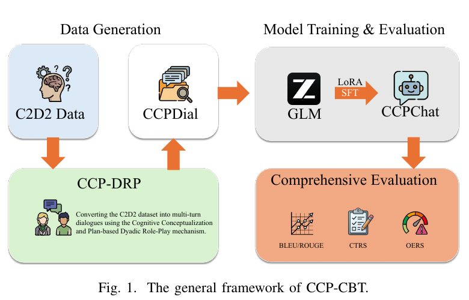
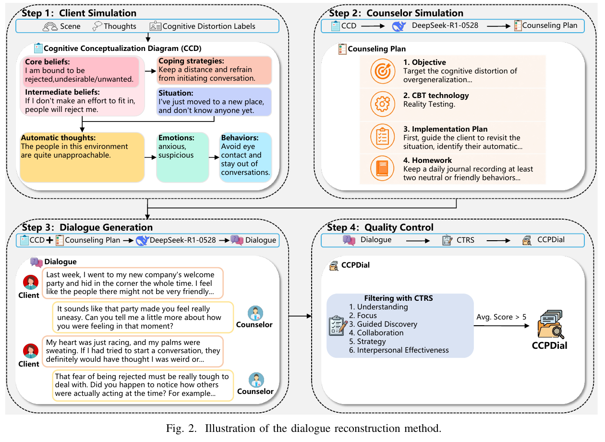

# CCP-CBT

## A Cognitive Conceptualization and Plan-based Multi-turn Dialogue Reconstruction and Evaluation Framework for CBT Psychological Counseling

CCP-CBT 是一个面向认知行为治疗（Cognitive Behavioral Therapy, CBT）心理咨询的多轮对话重构、模型训练与综合评测框架。它不只要求模型生成共情回复，还显式引入来访者的认知概念化图（Cognitive Conceptualization Diagram, CCD）和结构化咨询计划，使模型能够围绕认知问题开展有目标、连贯且尽量避免过度引导的 CBT 干预。

本仓库对应论文 **“CCP-CBT: A Cognitive Conceptualization and Plan-based Multi-turn Dialogue Reconstruction and Evaluation Framework for CBT Psychological Counseling”**，整理了论文所使用的数据统计、GLM-4 LoRA 微调代码、生成提示词及 CTRS/OERS 评测提示词。

> 本项目用于科研与数据处理，不构成医疗建议、心理诊断或治疗服务，也不应直接用于无人监管的真实临床场景。



## 核心贡献

- **CCP-DRP 数据重构方法**：通过“来访者模拟 + 咨询师模拟”的双角色机制，将 C2D2 中的情境、自动思维和认知扭曲标签扩展为结构化 CCD、CBT 咨询计划和多轮咨询对话。
- **CCPDial 数据集**：构建 7,500 条高质量 CBT 多轮咨询对话，每条数据均关联来访者 CCD 和结构化咨询计划。
- **CCPChat 模型**：在 CCPDial 上使用 LoRA 微调 GLM-4-9B-Chat，使模型从一般共情回复进一步转向目标明确的认知干预。
- **综合评测框架**：同时考察文本生成质量、CBT 专业能力和过度引导风险，覆盖 BLEU/ROUGE、CTRS 与 OERS。

## 方法概览

CCP-DRP 将数据生成划分为四个阶段：

1. **来访者模拟（Client Simulation）**：根据 C2D2 的情境、自动思维和认知扭曲标签生成来访者 CCD，使模拟建立在明确的认知结构上。
2. **咨询师模拟（Counselor Simulation）**：依据 CCD 生成结构化 CBT 咨询计划，包括干预目标、CBT 技术、实施步骤和家庭作业。
3. **对话生成（Dialogue Generation）**：同时以 CCD 和咨询计划约束双角色对话，保证来访者表达与其认知模式一致，并使咨询师沿既定干预目标推进。
4. **质量控制（Quality Control）**：先通过规则检查过滤结构错误和轮次不足的数据，再使用 CTRS 评估专业能力。平均 CTRS 低于 5 分的样本经过人工修订，直至满足质量要求。



## 数据集

### CCPDial

CCPDial 包含 7,500 条多轮 CBT 心理咨询对话。论文中的训练、验证和测试划分如下：

| 划分 | 样本数 |
| --- | ---: |
| Train | 7,132 |
| Validation | 296 |
| Test / CCPDialE | 72 |
| Total | 7,500 |

CCPDialE 采用分层随机抽样：覆盖 7 类认知扭曲及 1 个非扭曲对照类别，每个类别选取 9 条完整对话，共 72 条。

仓库中的 [CCPDial 数据统计文件](data/CCPDial_statistics.json) 给出了以下汇总信息：

- 平均对话长度为 **21.47** 轮，来访者和咨询师平均各有 **10.74** 次发言。
- 来访者单次发言平均 **47.31** 字，咨询师单次发言平均 **66.20** 字。
- 数据覆盖 7 类认知扭曲以及“非扭曲”对照类别。
- 咨询计划覆盖 12 种标准 CBT 技术。

### 认知扭曲分布

| 类型 | 数量 | 占比 |
| --- | ---: | ---: |
| 非扭曲 | 2,050 | 27.3% |
| 读心术 | 1,003 | 13.4% |
| 过度泛化 | 894 | 11.9% |
| 情绪化推理 | 751 | 10.0% |
| 乱贴标签 | 721 | 9.6% |
| 个人化归责 | 709 | 9.5% |
| 非黑即白 | 690 | 9.2% |
| 算命 | 682 | 9.1% |

### CBT 技术分布

| 技术 | 数量 | 技术 | 数量 |
| --- | ---: | --- | ---: |
| 证据检验 | 2,105 | 替代视角 | 1,246 |
| 灾难化解 | 1,023 | 规则软化 | 956 |
| 连续谱技术 | 796 | 饼图技术 | 745 |
| 行为实验 | 307 | 认知效用评估 | 128 |
| 利弊分析 | 99 | 问题解决训练 | 79 |
| 系统暴露疗法 | 10 | 现实检验 | 6 |

> 当前仓库只包含数据统计，不包含完整 CCPDial 训练数据。训练文件需要在获得合法授权并完成隐私与许可证检查后单独准备。

## 模型训练

论文以 **GLM-4-9B-Chat** 为基座，通过 LoRA 得到面向 CBT 咨询的 **CCPChat**。主要训练设置如下：

| 配置 | 论文设置 |
| --- | --- |
| Base model | GLM-4-9B-Chat |
| Fine-tuning | LoRA SFT |
| LoRA rank / alpha | 128 / 256 |
| LoRA dropout | 0.2 |
| Target modules | Attention 与 MLP 层 |
| Epochs | 10 |
| Effective batch size | 64 |
| Maximum sequence length | 3,072 tokens |
| Optimizer | AdamW |
| Scheduler | Cosine annealing with restarts |
| Weight decay | 0.05 |
| Precision | BF16 |
| Distributed training | DeepSpeed ZeRO-3 |
| Hardware | 2 × NVIDIA A100 |
| Best checkpoint | Validation ROUGE-L |

仓库中的 [LoRA 示例配置](configs/lora.example.yaml) 已将论文设置转换为相对路径配置。批量大小、数据加载线程和 DeepSpeed 设置仍应根据实际 GPU 数量及显存调整。

## 综合评测

### 1. 文本生成质量

使用 BLEU-1/2/3/4 与 ROUGE-1/2/L 评估词汇重合度和内容完整性。

在 CCPDialE 上，CCPChat 的结果为：

| B-1 | B-2 | B-3 | B-4 | R-1 | R-2 | R-L |
| ---: | ---: | ---: | ---: | ---: | ---: | ---: |
| **39.79** | **25.22** | **18.19** | **13.94** | **42.67** | **18.89** | **35.05** |

在外部数据集 CPsyCounE 上，CCPChat 获得 B-1 **25.81**、R-1 **26.00** 和 R-L **21.92**。论文指出，部分基线模型可能因训练数据与 CPsyCounE 来源重叠而受益，因此跨数据集结果需要谨慎解释。

### 2. CTRS 专业能力评测

CTRS 使用 0–6 分量表评估六项核心能力：

- Guided Discovery：引导式发现
- Focus：关键认知或行为聚焦
- Strategy：改变策略
- Understanding：理解与共情
- Interpersonal Effectiveness：治疗关系与人际效能
- Collaboration：协作式目标设定与决策

CCPChat 的双评估器结果如下：

| Evaluator | Guided Discovery | Focus | Strategy | Understanding | Interpersonal Effectiveness | Collaboration |
| --- | ---: | ---: | ---: | ---: | ---: | ---: |
| DeepSeek-R1-0528 | **4.09** | **4.13** | **4.03** | **4.47** | **4.54** | **3.35** |
| Gemini-2.5-Pro | **4.24** | **4.79** | **4.08** | **4.68** | **4.28** | **3.80** |

论文实验中，CCPChat 在两个评估器下均优于 GLM4-Z1-32B、GLM4-9B-Chat、CPsyCounX、PsyChat、MeChat 和 SoulChat。

### 3. OERS 过度引导风险评测

OERS（Over-Elicitation Risk Scale）评估咨询师是否通过诱导性提问、强制解释或预设议程影响来访者表达。分数越高，表示越能尊重来访者自主性：

| 分数锚点 | 含义 |
| ---: | --- |
| 0 | 频繁使用诱导性提问、强制解释或预设议程 |
| 2 | 偶尔使用强引导语言或将自己的解释框架施加给来访者 |
| 4 | 主要使用开放式提问、澄清和反映，较少植入期待或假设 |
| 6 | 以接纳、跟随和支持促进自主表达，不施加外部诱导 |

CCPChat 获得 DeepSeek-R1-0528 **3.47**、Gemini-2.5-Pro **3.87** 的 OERS 分数，在论文比较的模型中取得最高综合表现。

## 仓库结构

```text
.
├── assets/
│   ├── ccp-cbt-framework.png
│   └── ccp-drp-pipeline.png
├── configs/
│   ├── ds_zero_3.json
│   └── lora.example.yaml
├── data/
│   └── CCPDial_statistics.json
├── prompts/
│   ├── generate_ccd.md
│   ├── generate_plan.md
│   ├── generate_dialogue.md
│   ├── evaluate_ctrs.md
│   └── evaluate_oers.md
├── src/
│   └── finetune.py
├── .env.example
├── .gitignore
└── requirements.txt
```

## 提示词模板

| 文件 | 用途 | 主要输入 |
| --- | --- | --- |
| [generate_ccd.md](prompts/generate_ccd.md) | 生成来访者 CCD | 情境、自动思维、认知扭曲标签 |
| [generate_plan.md](prompts/generate_plan.md) | 生成 CBT 咨询计划 | CCD 各字段 |
| [generate_dialogue.md](prompts/generate_dialogue.md) | 重构多轮咨询对话 | CCD、CBT 技术、干预计划、家庭作业 |
| [evaluate_ctrs.md](prompts/evaluate_ctrs.md) | 评估 CBT 专业能力 | 完整多轮对话 |
| [evaluate_oers.md](prompts/evaluate_oers.md) | 评估过度引导风险 | 完整多轮对话 |

所有动态字段均使用 `{{variable_name}}` 形式的显式占位符，模板中不包含 API Key、个人目录或服务器绝对路径。

### 字段兼容性说明

原始 CCD 生成模板输出统一的 `核心信念` 数组，而 plan/dialogue 模板使用三个分类字段：

- `关于无助的核心信念`
- `关于不被爱的核心信念`
- `关于无价值的核心信念`

串联运行完整生成流程时，需要在 CCD 生成后增加核心信念分类转换步骤，或根据研究设置统一三个阶段的字段结构。仓库保留了各阶段原有的字段约定，以便复现实验。

## 快速开始

### 1. 安装环境

建议使用 Python 3.10，并根据本机 CUDA 版本先安装匹配的 PyTorch：

```bash
python -m venv .venv
source .venv/bin/activate
pip install -r requirements.txt
```

Windows PowerShell：

```powershell
.\.venv\Scripts\Activate.ps1
pip install -r requirements.txt
```

### 2. 准备训练数据

训练文件采用 JSONL 格式，每行至少包含一个 `messages` 字段：

```json
{"messages":[{"role":"user","content":"来访者输入"},{"role":"assistant","content":"咨询师回复"}]}
```

示例配置默认读取：

```text
data/train.jsonl
data/val.jsonl
data/test.jsonl   # 可选
```

训练数据默认被 `.gitignore` 忽略，以避免误上传可能包含隐私或使用限制的内容。

### 3. 启动 LoRA 微调

在仓库根目录执行：

```bash
python src/finetune.py json /path/to/glm-4-9b-chat-hf configs/lora.example.yaml
```

自动从最新 checkpoint 恢复：

```bash
python src/finetune.py json /path/to/glm-4-9b-chat-hf configs/lora.example.yaml yes
```

也可以将最后一个参数替换为具体 checkpoint 编号。

## API Key 与路径管理

仓库不包含真实 API Key。若后续添加生成或评测脚本，请复制 `.env.example` 为 `.env`，并通过环境变量读取配置：

```python
import os

api_key = os.environ["OPENAI_API_KEY"]
base_url = os.getenv("OPENAI_BASE_URL", "https://api.openai.com/v1")
model_name = os.environ["MODEL_NAME"]
```

请勿将真实密钥、内网地址、个人目录、服务器绝对路径、日志或 notebook 输出提交到公开仓库。

## 局限性与伦理说明

论文指出当前框架仍存在以下限制：

- CCPDial 主要通过结构化认知概念化进行合成，属于相对理想化的“脚本式”对话，并非真实咨询记录。
- 当前评测为离线评测，没有验证模型与真实用户长期互动时的安全性和临床有效性。
- LLM 评估不能替代持证心理咨询师或临床专家评审。
- 面向真实部署时，需要增加实时风险监测、高风险案例升级机制、人工监督、隐私保护和长期效果研究。

不要将 CCPChat 或本仓库中的提示词用于自动诊断、危机干预或替代专业心理健康服务。

## 论文引用

如在研究中使用本项目，请引用论文：

> *CCP-CBT: A Cognitive Conceptualization and Plan-based Multi-turn Dialogue Reconstruction and Evaluation Framework for CBT Psychological Counseling.*

作者、会议/期刊和 DOI 等书目信息应以论文正式发布版本为准。

## License

本项目采用 [Apache License 2.0](LICENSE) 发布。
